# AWS Deployed Application
Access the application at [http://15.206.210.135:8000/](http://15.206.210.135:8000/)

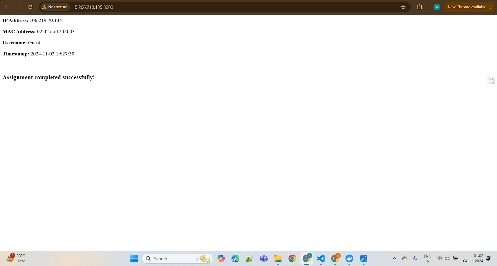

## Table of Contents
- [Initial Setup](#initial-setup)
- [Docker Image Building](#docker-image-building)
- [Running the Application](#running-the-application)
- [Error Resolution](#error-resolution)
- [AWS Deployment](#aws-deployment)

## Initial Setup

### Cloning the repository 
git clone  [https://github.com/qoala-engineering/devops-internship-challenge.git](https://github.com/qoala-engineering/devops-internship-challenge.git)

cd devops-internship-challenge

### Removing the Original GitHub Remote
git remote remove origin

### Add your personal repository as the new remote
git remote add origin https://github.com/Akshit-Tambi/devops-qoala-assignment-akshit_tambi-21ucs015.git

git branch -M main

git push -u origin main

## Docker Image Building
### Building local-python-app
docker build -t local-python-app .

#### Resolved Issues in python dockerfile
| Issue | Resolution | Explanation | Error Screenshot |
|-------|------------|-------------|------------------|
| EXPOSE port in string format | Changed to integer | Docker EXPOSE requires numeric ports, not string values | 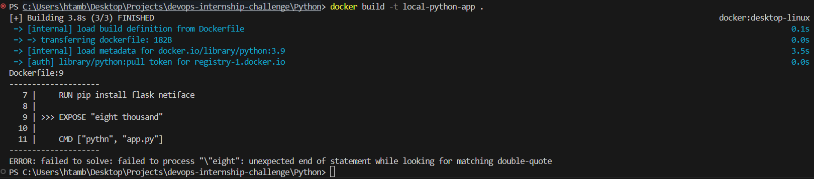 |
| Working directory name | Renamed to app and updated COPY paths | Incorrect working directory caused file not found errors | 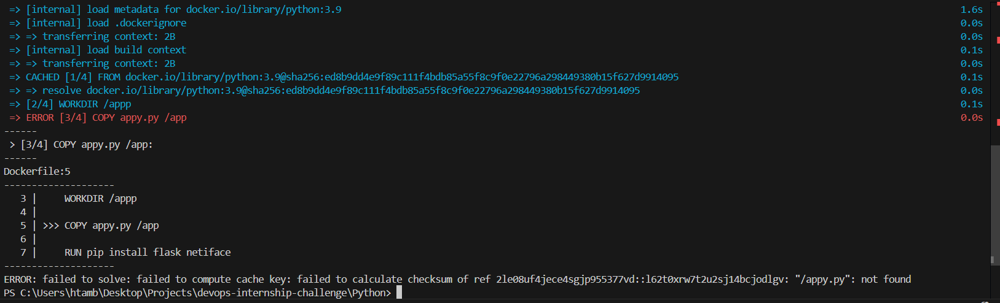 |
| Package name typo | Corrected netiface to netifaces | Python package installation failed due to incorrect package name | 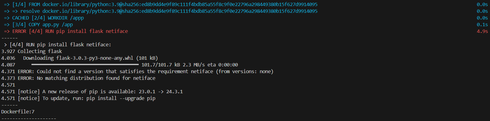 |
| CMD spelling | Fixed python spelling | Container failed to start due to incorrect command name | 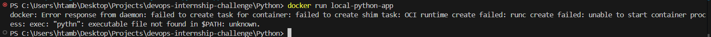 |

### Building local-nginx
docker build -t nginx .

#### Resolved Issues in Nginx dockerfile
| Issue | Resolution | Explanation | Error Screenshot |
|-------|------------|-------------|------------------|
| Base image spelling | Corrected latest spelling | Image pull failed due to incorrect tag name | 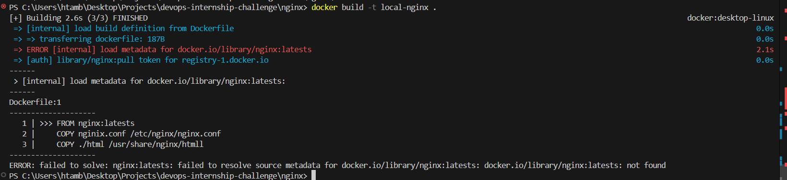 |
| EXPOSE port format | Changed string to integer | NGINX ports must be specified as numbers | 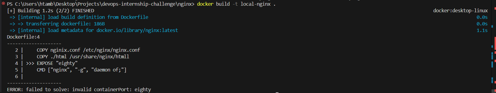 |
| COPY command | Fixed source file name | Files weren't copying due to incorrect source path | 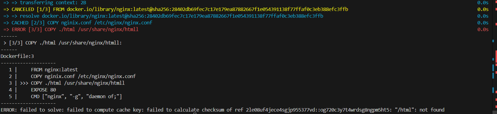 |
| Redundant COPY | Removed COPY ./html /usr/share/nginx/htmll | Double copying caused conflicts and typo in destination path | 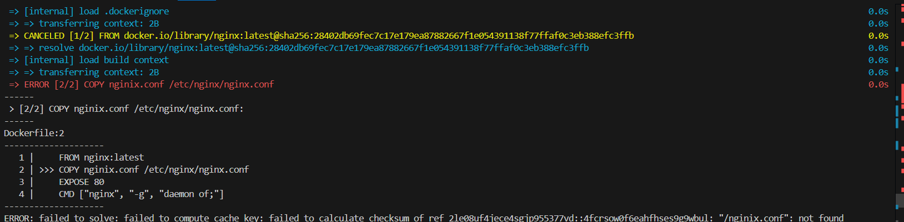 |
| CMD configuration | Updated NGINX run command | NGINX failed to start due to incorrect daemon configuration |

#### Docker Compose Fixes
| Issue | Resolution | Explanation | Error Screenshot |
|-------|------------|-------------|------------------|
| Networks configuration | Removed unsupported options block | Docker Compose version doesn't support legacy network options | 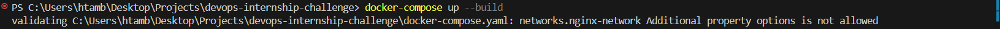 |
| Port formatting | Fixed NGINX port number format | Port mapping syntax was incorrect causing bind failures | 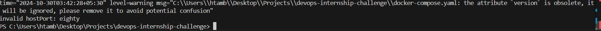 |
| Volume paths | Corrected volume mapping | Volumes weren't mounting due to incorrect path format |
| Service exposure | Changed expose to ports | Services weren't accessible due to wrong port configuration |
| Network type | Fixed bridge spelling | Network creation failed due to incorrect driver name |
 
### After  building and running the docker compose file I found out the error in the logs of the nginx.
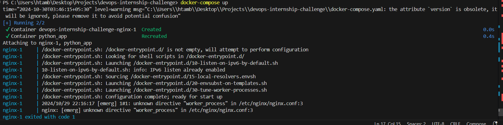

### NGINX Configuration
#### Fixed Issues in nginx.conf
| Issue | Resolution | Explanation | Error Screenshot |
|-------|------------|-------------|------------------|
| Worker processes | Changed worker_process auto to worker_processes auto; | NGINX failed to start due to missing semicolon and plural form |  |
| Include directives | Corrected include file references | Configuration loading failed due to incorrect include paths |

### After this I successfully build and run the docker compose file I hosted it on http://localhost:8000/
However as seen in the image the MAC address was wrong and to fix it I looked into the app.py file.

### Python Application Updates
Modified MAC address retrieval in app.py:

iface = 'eth0'  # Use Docker's main network interface

*Explanation*: Original code failed to retrieve MAC address consistently in Docker environment; eth0 is the standard Docker network interface.

## Application Status
- Successfully built and deployed locally
- Accessible at: http://localhost:8000/
- Ready for AWS deployment

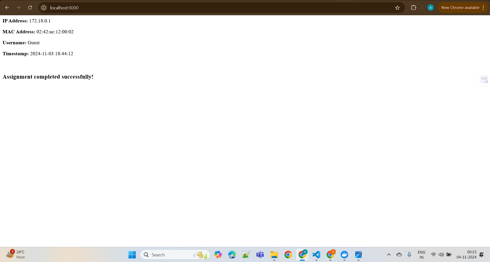

## AWS Deployment
Following successful local testing, the application has been prepared for AWS deployment. Refered to AWS documentation for specific deployment steps in your environment.

